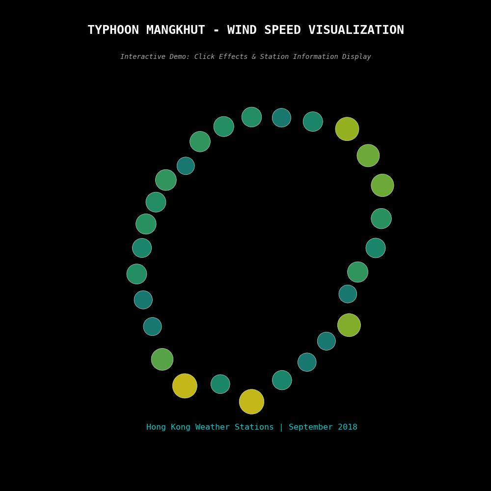
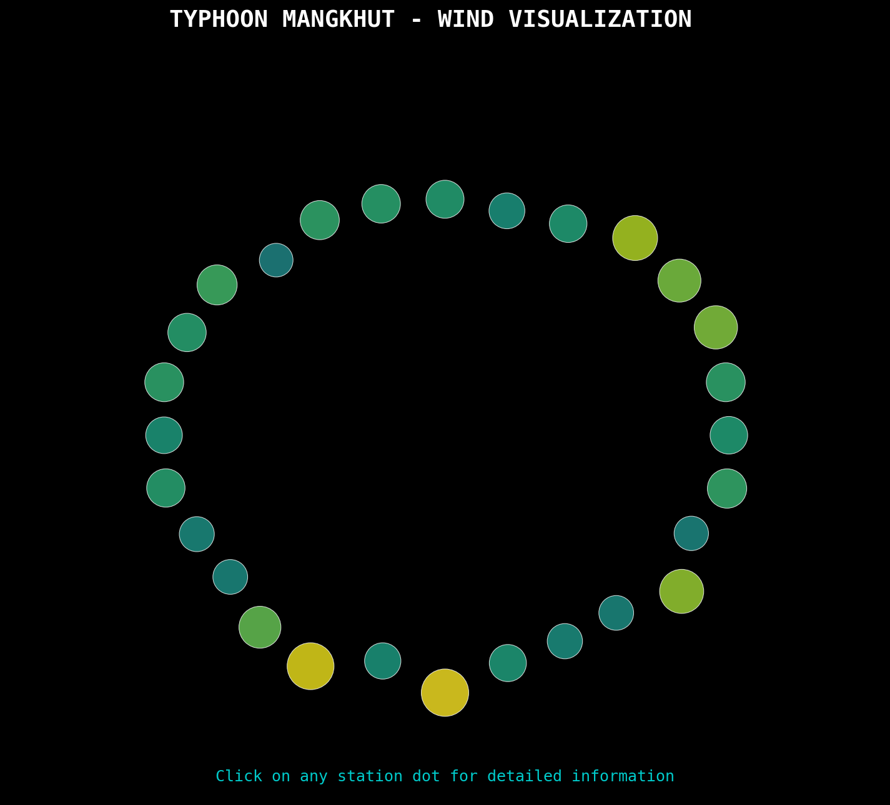
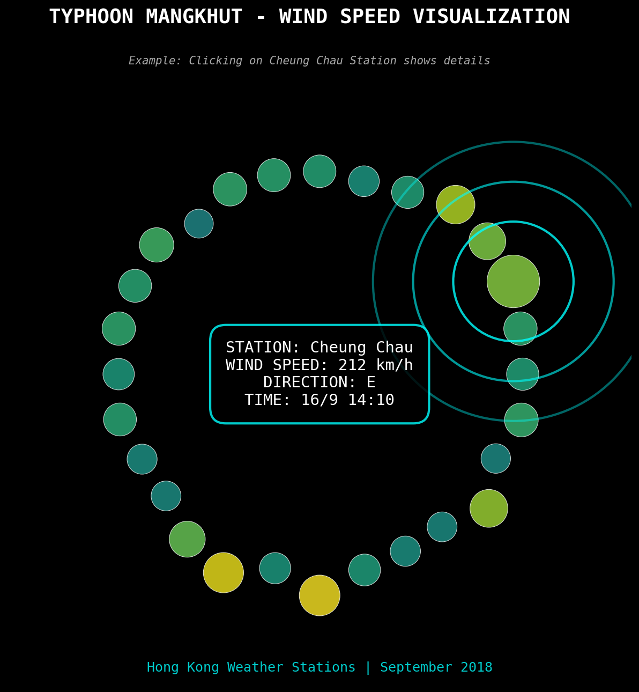

# Typhoon Mangkhut - Artistic Wind Visualization

## Project Introduction

This project transforms the meteorological station data of Typhoon Mangkhut (2018, Hong Kong) into an artistic visualization animation.
By turning raw wind data into a dynamic display, it captures the power of natural forces while adding breathing-like rhythms and ripple effects, exploring the boundary between data visualization and artistic expression.

## Data Source

**Source:** Hong Kong Observatory (HKO)

**Data content:**
- Maximum gust wind speed, wind direction, and observation time at various meteorological stations during Typhoon Mangkhut

**Data collection:**
- Scraped from official HKO HTML tables
- Processed and cleaned using BeautifulSoup + pandas

## Creativity & Artistic Design

This project is more than a traditional wind speed chart — it is a data-driven artistic animation:

**Spatial Layout:**
- Each meteorological station is represented as a circle point, distributed radially
- The radius is determined by wind speed (higher speed → farther from center)

**Visual Encoding:**
- Color gradient (viridis colormap) → wind intensity
- Circle size → gust strength

**Artistic Effects:**
- **Breathing effect:** all points gently oscillate, symbolizing air movement
- **Interactive ripple:** clicking on a station triggers a ripple-like expansion, representing the shockwave of strong winds
- **Fading annotation:** clicked station info (location, wind speed, wind direction, time) appears in the center, fades in → stays → fades out

Through this design, the dataset is transformed from raw numbers into a scientific yet artistic dynamic piece.

## How to Run

1. **Clone the repository:**
   ```bash
   git clone https://github.com/oriiizz/Typhoon_assignment2.git
   cd Typhoon_assignment2
   ```

2. **Install dependencies:**
   ```bash
   pip install -r requirements.txt
   ```

3. **Run the visualization:**
   ```bash
   python src/typhoon_visualization.py
   ```

4. **Interaction:**
   - Click on a circle → view wind speed, direction, and observation time for that station
   - Info will fade in and out at the center, while a ripple expansion animation is triggered

## Demo Result

### 🎬 Interactive Features Demo


*Complete interactive demonstration showing click effects, station information display, and water ripple animations*

### 📸 Before & After Comparison

**Basic View:**


**Click Effect:**


### 🎯 Key Interactive Features:
- **🖱️ Click Response**: Click any station dot to view detailed information
- **💧 Water Ripple Effect**: Beautiful expanding circles simulate wind impact
- **📊 Information Display**: Station name, wind speed, direction, and time
- **✨ Visual Feedback**: Highlighted dots with smooth fade-in/out effects
- **🌊 Breathing Animation**: Continuous gentle movement simulating air flow

### Export Your Own Media

**Generate Interactive Demo GIF:**
```bash
python src/export_interactive_demo.py
```

**Create Screenshots:**
```bash
python src/generate_screenshots.py
```

## Project Structure

```
Typhoon/
├── README.md
├── requirements.txt
├── assets/
│   ├── typhoon_interactive_demo.gif   # Interactive demo GIF
│   ├── screenshot_basic.png           # Basic view screenshot
│   └── screenshot_clicked.png         # Click effect screenshot
├── data/
│   ├── typhoon_mangkhut.html           # HKO weather data
│   └── wind_timeseries.csv            # Time series data
└── src/
    ├── typhoon_visualization.py       # Main interactive script
    ├── export_interactive_demo.py     # Interactive demo GIF exporter
    └── generate_screenshots.py        # Screenshot generator
```

## Summary

This project uses Typhoon Mangkhut wind speed data to create a visualization that merges data science with artistic design.

It reflects the real wind speed distribution while expressing the aesthetic and dynamic beauty of natural forces through interactive animation.